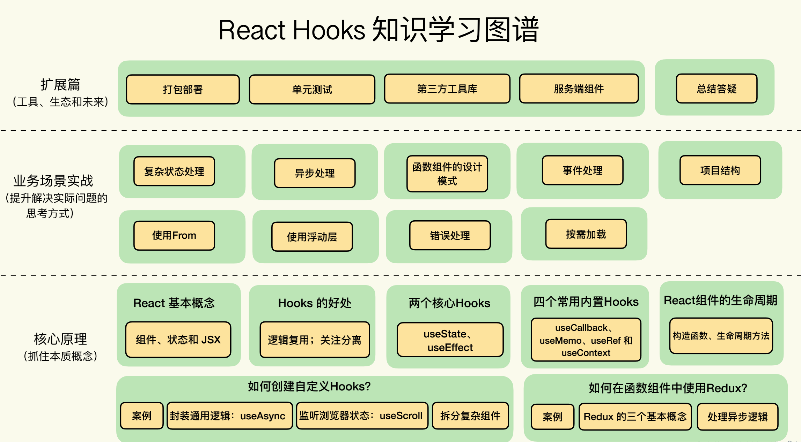

# React

## 源码解析

[[React技术揭秘]--卡颂](https://react.iamkasong.com/)
> 记得再去看B站的视频

[React 源码解析](https://react.jokcy.me/)

[react源码解析2.react的设计理念](https://xiaochen1024.com/courseware/60b1b2f6cf10a4003b634718/60b1b31ccf10a4003b63471a)

[React的秘密](https://segmentfault.com/blog/react-secret)
> 此系列文章以React的更新过程为主线，从render到commit。并对其他的内容分析，例如事件机制、Scheduler调度原理、Hooks以及context的原理。

### Fiber

[The how and why on React’s usage of linked list in Fiber to walk the component’s tree](https://indepth.dev/posts/1007/the-how-and-why-on-reacts-usage-of-linked-list-in-fiber-to-walk-the-components-tree)

> - 讲解Fiber使用链表的原因
> - 同时还有一个链表执行的过程demo [Linked list traversal](https://stackblitz.com/edit/js-tle1wr?file=index.js)

[An Introduction to React Fiber - The Algorithm Behind React](https://www.velotio.com/engineering-blog/react-fiber-algorithm)

> 中文翻译 [如何理解 React Fiber 架构？ - 弹铁蛋同学的回答 - 知乎](https://www.zhihu.com/question/49496872/answer/2137978516)

[Inside Fiber: in-depth overview of the new reconciliation algorithm in React](https://indepth.dev/posts/1008/inside-fiber-in-depth-overview-of-the-new-reconciliation-algorithm-in-react)

[In-depth explanation of state and props update in React](https://indepth.dev/posts/1009/in-depth-explanation-of-state-and-props-update-in-react)

### FiberRoot

[React源码解析之FiberRoot](https://www.jianshu.com/p/802db7b79e28)

## Hooks

[A Complete Guide to useEffect](https://overreacted.io/a-complete-guide-to-useeffect/)

[How Are Function Components Different from Classes?](https://overreacted.io/how-are-function-components-different-from-classes/)

[Making setInterval Declarative with React Hooks](https://overreacted.io/making-setinterval-declarative-with-react-hooks/)

> Redux的作者 [Dan Abramov](https://overreacted.io/) 写的。博文中英文都有，而且内容写的很透彻，值得多看几次。

[React Hooks Tutorial](https://www.robinwieruch.de/react-hooks)

[How to fetch data with React Hooks](https://www.robinwieruch.de/react-hooks-fetch-data)
> 讲解如何使用React Hook去请求数据

## 课程

[React 实战进阶 45 讲](https://time.geekbang.org/course/intro/100009301)

[React Hooks 核心原理与实战 --- 极客时间](https://time.geekbang.org/column/intro/100079901)

