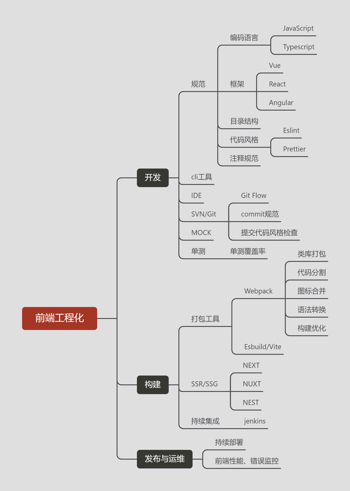

# 什么是前端工程化？

被问到这个问题的时候，突然之间愣了。回答时，思维跳跃，语无伦次，毫无逻辑可言，很多要答的地方都没有说出来，比如规范这一块。

刚好下来画个思维导图，整理一下。

## 个人理解

### 前端工程化

自从有了 `NodeJS`，有了JS模块 `CommonJS` 、`ESM`，有了 `gulp` `Webpack` 等构建工具，才算有了前端工程化的基础。

前端工程化，并不简简单单只是一个构建工具 `Webpack` 就能代替的，而是包含开发、自测、构建、部署、监控等所有环节。

前端工程化，也是一个高度自动化的过程。包含但不限于代码 `commit` 规范校验，单测覆盖率，自动化性能测试，CI/CD，监控自动报警等等。

### 前端工程化的目的

1. 减少重复的劳动，提高前端开发的效率
2. 提升代码的质量

