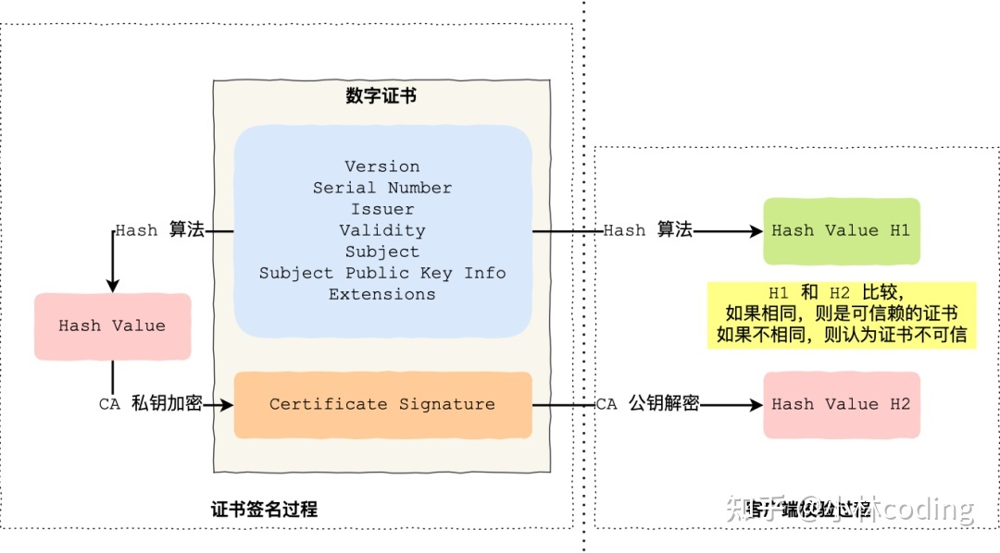

# Https

`HTTPS` （全称：Hyper Text Transfer Protocol over SecureSocket Layer），是以安全为目标的 `HTTP` 通道，在HTTP的基础上通过传输加密和身份认证保证了传输过程的安全性。

> [HTTPS -- 百度百科](https://baike.baidu.com/item/HTTPS/285356)

`HTTPS` 协议是在 `HTTP` 的基础下加入 `SSL/TLS` 构建的可进行加密传输、身份认证的网络协议。主要是通过 `数字证书` `加密算法` `非对称密钥` 等实现网络安全传输。

`HTTPS` 设计的目标有三个：

1. 数据保密性
2. 数据完整性
3. 身份校验安全性

## 加密算法

1. 非对称加密
   1. 加密使用的密钥和解密使用的密钥是不相同的。分为公钥和私钥，公钥负责加密，私钥负责解密。
   2. 算法：一般是 RSA
   3. 加解密性能差
2. 对称加密
   1. 加密和解密使用的密钥是相同的
   2. 算法：DES、AES
   3. https建立连接后，用生成的对称密钥进行加解密操作
3. hash算法
   1. 将任意长度的信息转换为较短的固定长度的值，算法不可逆。一般用于验证签名。
   2. 算法： MD5、SHA-1、SHA-256

## Https建立连接的过程（ `ECDH` 版本）

前提是已经建立HTTP连接。

1. 客户端将它所支持的算法列表和一个用作产生密钥的随机数发送给服务器；
2. 服务器从算法列表中选择一种加密算法，并将它和一份包含服务器公用密钥的证书发送给客户端；该证书还包含了用于认证目的的服务器标识，服务器同时还提供了一个用作产生密钥的随机数；
3. 客户端对服务器的证书进行验证（有关验证证书，可以参考数字签名），并抽取服务器的公用密钥；然后，再产生一个称作 pre_master_secret 的随机密码串，并使用服务器的公用密钥对其进行加密，并将加密后的信息发送给服务器；
4. 客户端与服务器端根据 pre_master_secret 以及客户端与服务器的随机数值独立计算出对称加密密钥；

## CA数字证书

数字证书包含了：

- 公钥；
- 持有者信息；
- 证书认证机构（CA）的信息；
- CA 对这份文件的数字签名及使用的算法；
- 证书有效期；
- 还有一些其他额外信息；

### 客户端如何验证CA数字证书的有效性呢？

摘自 [浏览器如何验证HTTPS证书的合法性？ - 小林coding的回答 - 知乎](https://www.zhihu.com/question/37370216/answer/1914075935)。

CA签发证书的过程，上图左边部分。

- 首先 CA 会把持有者的公钥、用途、颁发者、有效时间等信息打成一个包，然后对这些信息进行 Hash 计算，得到一个 Hash 值；
- 然后 CA 会使用自己的私钥将该 Hash 值加密，生成 Certificate Signature，也就是 CA 对证书做了签名；
- 最后将 Certificate Signature 添加在文件证书上，形成数字证书；

客户端校验服务端的数字证书的过程，上图右边部分：

- 首先客户端会使用同样的 Hash 算法获取该证书的 Hash 值 H1；
- 通常浏览器和操作系统中集成了 CA 的公钥信息，浏览器收到证书后可以使用 CA 的公钥解密 Certificate Signature 内容，得到一个 Hash 值 H2 ；
- 最后比较 H1 和 H2，如果值相同，则为可信赖的证书，否则则认为证书不可信。

## HTTPS的优点和缺点

// TODO

## 参考资料

[HTTPS -- 百度百科](https://baike.baidu.com/item/HTTPS/285356)

[浏览器如何验证HTTPS证书的合法性？ - 小林coding的回答 - 知乎](https://www.zhihu.com/question/37370216/answer/1914075935)

