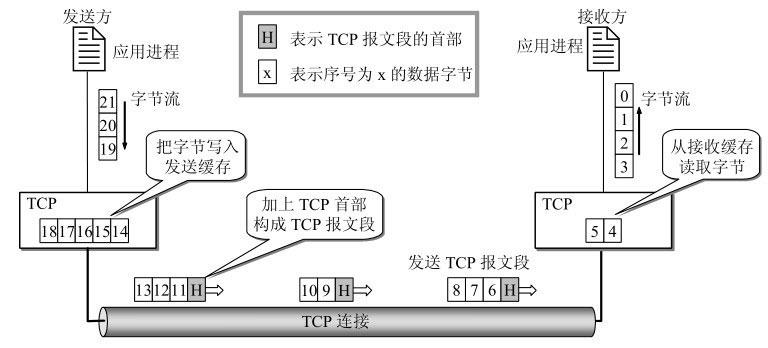
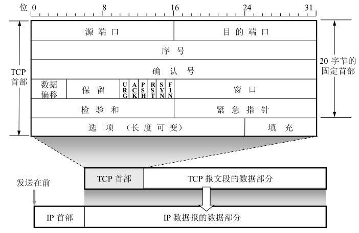

# TCP

传输控制协议（TCP，Transmission Control Protocol），是一种面向连接的、可靠的、基于字节流的传输层通信协议

[TCP -- 百度百科](https://baike.baidu.com/item/TCP/33012)

## 主要特点

1. `面向字节流`
   1. 
2. `面向连接`
   1. 应用程序在使用TCP协议之前，必须先建立TCP连接。
   2. 在传送数据完毕后，必须释放已经建立的TCP连接。
3. `可靠传输`
   1. 通过TCP连接传送的数据，无差错、不丢失、不重复、并且按序到达。
4. `缓冲传输`
5. `双全工`
   1. TCP允许通信双方的应用进程在任何时候都能发送数据。TCP连接的两端都设有发送缓存和接收缓存，用来临时存放双向通信的数据。
6. `流量控制`

为满足TCP协议的这些特点，TCP协议做了如下的规定：

1. 数据分片：在发送端对用户数据进行分片，在接收端进行重组，由TCP确定分片的大小并控制分片和重组；
2. 到达确认：接收端接收到分片数据时，根据分片数据序号向发送端发送一个确认；
3. 超时重发：发送方在发送分片时启动超时定时器，如果在定时器超时之后没有收到相应的确认，重发分片；
4. 滑动窗口：TCP连接每一方的接收缓冲空间大小都固定，接收端只允许另一端发送接收端缓冲区所能接纳的数据，TCP在滑动窗口的基础上提供流量控制，防止较快主机致使较慢主机的缓冲区溢出；
5. 失序处理：作为IP数据报来传输的TCP分片到达时可能会失序，TCP将对收到的数据进行重新排序，将收到的数据以正确的顺序交给应用层；
6. 重复处理：作为IP数据报来传输的TCP分片会发生重复，TCP的接收端必须丢弃重复的数据；
7. 数据校验：TCP将保持它首部和数据的检验和，这是一个端到端的检验和，目的是检测数据在传输过程中的任何变化。如果收到分片的检验和有差错，TCP将丢弃这个分片，并不确认收到此报文段导致对端超时并重发。

## TCP头部

TCP报文段分为首部和数据两部分。

TCP报文段首部的前 `20` 个字节是固定的，后面有 `4n` 字节是根据需要而增加的。因此TCP首部最小长度是 `20` 字节。

1. `源端口` 和 `目的端口` ，各占2个字节
2. `序号` 占4字节。序号范围是[0, 232 - 1]。
   1. TCP是面向字节流的。在一个TCP连接中传送的字节流中的每一个字节都按顺序编号。
   2. 整个要传送的字节流的起始序号必须在连接建立时设置。
   3. 首部中的序号字段值则指的是本报文段所发送的数据的第一个字节的序号。
3. `确认号` 占4字节，是期望收到对方下一个报文段的第一个数据字节的序号。
   1. 例如，B正确收到了A发送过来的一个报文段，其序号字段值是501，而数据长度是200字节（序号501～700）。B正确收到了A发送的到序号700为止的数据。
   2. B在发送给A的确认报文段中把确认号置为701
4.  `数据偏移` 占4位，它指出TCP报文段的数据起始处距离TCP报文段的起始处有多远。
5.  `保留` 占6位
6.  `标志位`
    1. 紧急URG (URGent) 当URG = 1时，表明紧急指针字段有效。
    2. 确认ACK (ACKnowlegment) 仅当ACK = 1时确认号字段才有效。TCP规定，在连接建立后所有传送的报文段都必须把ACK置1。
    3. 推送 PSH
    4. 复位RST
    5. 同步SYN
    6. 终止FIN 
7. `窗口` 占2字节。窗口指的是发送本报文段的一方的接收窗口（而不是自己的发送窗口）。
   1. 窗口值告诉对方：从本报文段首部中的确认号算起，接收方目前允许对方发送的数据量。
8. `检验和` 占2字节。检验和字段检验的范围包括首部和数据这两部分
9. `紧急指针` 占2字节。
10. `选项` 长度可变，最长可达40字节。

## TCP连接管理

### TCP建立连接

TCP，使用三次握手（Three-way Handshake）来建立连接，需要客户端和服务端总共发送3个包以确认连接的建立。

### 终止TCP连接

使用四次挥手（Four-way Wavehand）终止连接。断开一个TCP连接时，需要客户端和服务端总共发送4个包以确认连接的断开。

// TODO:

## TCP可靠传输

### 工作原理

### 实现

## TCP流量控制

## TCP拥塞控制

### TCP的有限状态机

## 内容来源

[TCP -- 百度百科](https://baike.baidu.com/item/TCP/33012)

[计算机网络 --- 谢希仁](https://book.douban.com/subject/26960678/)

[TCP协议详解](https://www.jianshu.com/p/ef892323e68f)

[TCP头部分析与确认号的理解](https://www.cnblogs.com/xcywt/p/8075623.html)