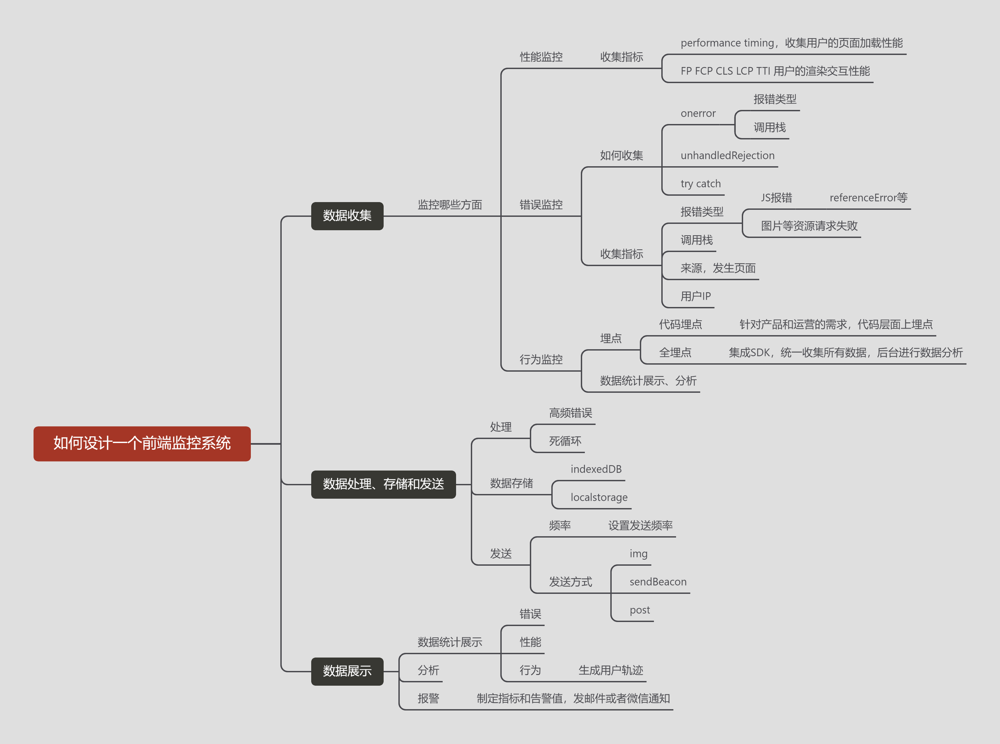

# 如何设计一个前端监控系统

TODO: 待完善

- [ ] 错误信息处理，需针对不同的报错类型分类
- [ ] SourceMap上传和处理
- [ ] 架构调整

> 目的主要是帮助自己融合已学的知识

## 市面上现有产品

市面上前端异常监控系统挺多的，如果公司不差钱就别自己造轮子了。

1. sentry
2. FundeBug
3. arms
4. WebFunny
5. BadJs

## 文章

[前端监控和前端埋点方案设计](https://segmentfault.com/a/1190000015864670)