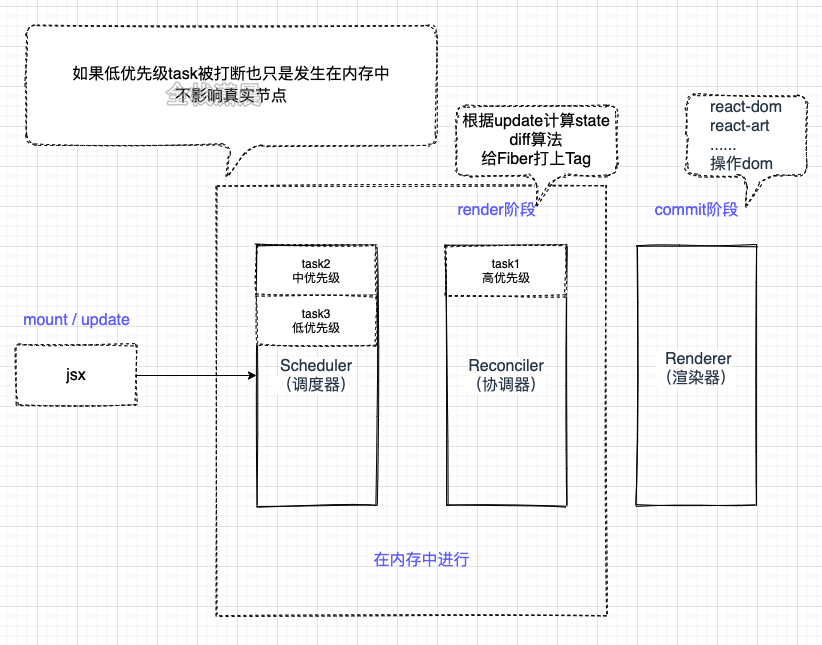

# React 架构

## React15架构

分为两层：

- 'Stack' Reconciler(协调器) ---- 负责找出变化的组件
- Renderner(渲染器) --- 负责将变化的组件渲染到页面上

:::tip 提示
注意，体会 **Stack** 这个词。[官网说明](https://zh-hans.reactjs.org/docs/implementation-notes.html)

15架构的缺点是，组件递归更新，更新一旦开始，中途就无法中断。当递归的层级很深，更新时间超过16ms，用户的交互就会卡顿。
解决方案：用可中断的异步更新代替同步更新。
:::

## React16架构

分为三层：

- Scheduler（调度器）—— 调度任务的优先级，高优任务优先进入Reconciler
- 'Fiber' Reconciler（协调器）—— 负责找出变化的组件，并打上不同的Flags
- Renderer（渲染器）—— 负责将变化的组件渲染到页面上

> 使用了最新的 **Fiber** 架构

### Scheduler 调度器

调度器的作用是，当浏览器有剩余时间的时候通知我们，在浏览器空闲时出发回调，同时还提供了多种调度任务优先级供任务设置。优先级工作分为 高优先级（动画） 和 低优先级的工作（大型计算函数）。调度可以基于时间或者优先级，高优先级的工作应该被安排在低优先级的工作之上。

> // TODO 如何调度？
> - 任务的优先级，使用任务的过期时间表示
> - 任务队列中，使用的是小顶堆 `SchedulerMinHeap.js`
> - 现在的版本中，采用 `Lane` 模型来处理任务的优先级

### Reconciler 协调器

`Fiber Reconciler` 是 `React 16` 中新的协调算法。 协调器是在 render 阶段工作。会创建和更新Fiber节点。在mount阶段，生成Fiber对象，在update时，会更新最新的state形成的jsx对象和current Fiber树对比复用，构建 workInProgress Fiber 树。

> 这个对比的过程就是 diff 算法。
> - diff算法发生在render阶段的 reconcileChildFibers 中。
> - diff分为：单节点和多节点的

- 能够把可中断的任务切片处理。
- 能够调整优先级，重置并复用任务。
- 能够在父元素与子元素之间交错处理，以支持 React 中的布局。
- 能够在 `render()` 中返回多个元素。
- 更好地支持错误边界。

> [reconcilers--官网](https://zh-hans.reactjs.org/docs/codebase-overview.html#reconcilers)

:::tip
整个Scheduler与Reconciler的工作都在**内存**中进行。只有当所有组件都完成Reconciler的工作，才会统一交给Renderer。
:::

### Renderer 渲染器

**Renderer** 根据 **Reconciler** 为虚拟DOM打的标记，同步执行对应的操作。

> Renderer 在 commit 阶段工作，遍历 render 阶段生成的 effectList 上的节点，执行真实的DOM操作和一些生命周期

看图。[来源于--全栈潇晨](https://xiaochen1024.com/courseware/60b1b2f6cf10a4003b634718/60b1b328cf10a4003b63471b)



## Fiber

> [Fiber起源](https://github.com/acdlite/react-fiber-architecture)

### Fiber的含义

1. 对于架构来说，相对于以往的 `Stack reconciler` ，新的是基于 `Fiber节点(FiberNode)` 实现的
2. 作为静态的数据结构，每个 `Fiber节点` 对应一个 `React element` ，保存了该组件的类型（函数组件/类组件/原生组件...）、对应的DOM节点等信息。
3. 作为动态的工作单元来说，每个 `Fiber节点` 保存了本次更新中该组件改变的状态、要执行的工作（需要被删除/被插入页面中/被更新...）。

### Fiber结构

1. 作为架构 --- Fiber链表树
2. 作为静态数据结构 --- Fiber节点
3. 作为动态工作单元 --- Fiber节点中保存了本次更新相关的信息

FiberNode定义 [FiberNode 源码](https://github.com/facebook/react/blob/1fb18e22ae66fdb1dc127347e169e73948778e5a/packages/react-reconciler/src/ReactFiber.new.js#L117)

```js
function FiberNode(
  tag: WorkTag,
  pendingProps: mixed,
  key: null | string,
  mode: TypeOfMode,
) {
  // Instance
  this.tag = tag;
  this.key = key;
  this.elementType = null;
  this.type = null;
  this.stateNode = null;

  // Fiber
  this.return = null; // reference to the parent
  this.child = null; // reference to the first child
  this.sibling = null; // reference to the first sibling
  this.index = 0;

  this.ref = null;

  this.pendingProps = pendingProps;
  this.memoizedProps = null;
  this.updateQueue = null;
  this.memoizedState = null;
  this.dependencies = null;

  this.mode = mode;

  // Effects
  this.effectTag = NoEffect;
  this.subtreeTag = NoSubtreeEffect;
  this.deletions = null;
  this.nextEffect = null;

  this.firstEffect = null;
  this.lastEffect = null;

  this.lanes = NoLanes;
  this.childLanes = NoLanes;

  this.alternate = null;
}
```

### Fiber双缓存

双缓存是指存在两颗Fiber树，`current Fiber` 树描述了当前呈现的dom树，`workInProgress Fiber` 是正在更新的Fiber树，这两颗Fiber树都是在内存中运行的，在workInProgress Fiber构建完成之后会将它作为current Fiber应用到dom上。

在 mount 阶段（首次渲染），会根据 jsx 对象，构建 Fiber 对象，形成Fiber树，然后这棵 Fiber 树会作为 current Fiber 应用到真是的DOM上。

在 update 阶段（状态更新），会根据状态变更后的 jsx 对象和 current Fiber 树做对比
形成新的 workInProgress Fiber （字面意思：正在工作的Fiber树），当渲染完成后， workInProgress Fiber 切换为 current Fiber

## 参考文章

[React15架构](https://react.iamkasong.com/preparation/oldConstructure.html)

[新的React架构](https://react.iamkasong.com/preparation/newConstructure.html)

[Fiber架构的实现原理](https://react.iamkasong.com/process/fiber.html)

[reconcilers--官网](https://zh-hans.reactjs.org/docs/codebase-overview.html#reconcilers)

[react源码架构](https://xiaochen1024.com/courseware/60b1b2f6cf10a4003b634718/60b1b328cf10a4003b63471b)

