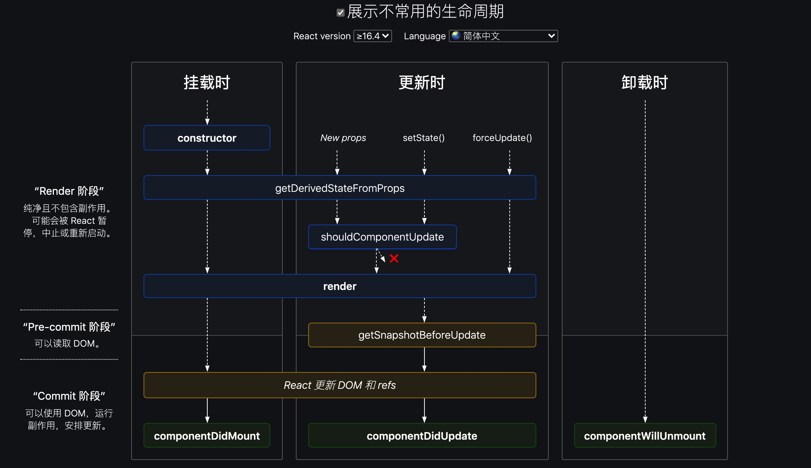

# React的生命周期

React的生命周期，看图会更容易理解。

## 生命周期流程

[展示生命周期](https://projects.wojtekmaj.pl/react-lifecycle-methods-diagram/)



### 挂载时

`constructor` -> `render` -> `componentDidMount`

### 更新时

`New props/ setState() / forceUpdate()` -> `render` -> `componentDidUpdate`

### 卸载时

`componentWillUnmount`

### 渲染顺序

父子结构组件，react的渲染顺序是怎么样的？

```js
/**
 * 渲染顺序是什么样的？
 *      App
 *      /   \
 *  parent  sibling
 *    /  \
 *  son  son
 */

const Son1 = () => {
  console.log("Son1");

  return <div>Son1</div>;
};

const Son2 = () => {
  console.log("Son2");
  return <div>Son2</div>;
};

const Parent = () => {
  console.log("Parent");
  return (
    <div>
      <Son1 />
      <Son2 />
    </div>
  );
};

const Sibling = () => {
  console.log("sibling");
  return <div>sibling</div>;
};

export default function App() {
  return (
    <div className="App">
      <Parent />
      <Sibling />
    </div>
  );
}
// Parent
// Son1
// Son2
// Sibling
```

1. 深度优先
2. 先父后子
3. 子渲染后再往上归，到（父）相邻的兄弟节点

[Demo](https://codesandbox.io/s/react-lifecircle-3u2mx?file=/src/App.tsx)

// TODO:

### 类组件生命周期钩子函数和useEffect的差异

#### 类组件 cDM cDU 钩子

## 参考

[React生命周期流程图及简述](https://www.jianshu.com/p/fb25accc5548)

